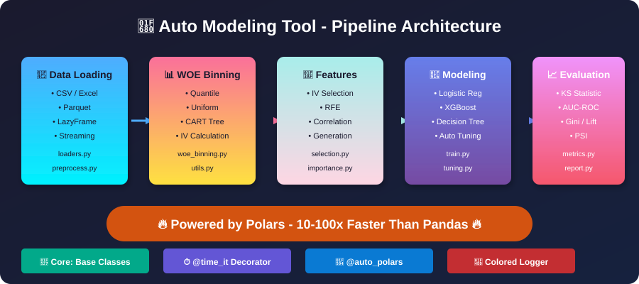

<div align="center">

# 🚀 Auto Modeling Tool

<p align="center">
  <strong>High-Performance Auto-Modeling Framework | 高性能自动建模框架</strong>
</p>

<p align="center">
  接收 Pandas 或 Polars 数据，返回结构化 Report 对象。<br>
  覆盖信贷风控建模全流程：数据画像 → 分箱评估 → 特征筛选 → 建模 → 监控 → 评分卡。
</p>

<p align="center">
  <a href="https://levywiseco.github.io/auto-modeling-tool/">📚 Documentation</a> •
  <a href="#-从任务开始--start-from-your-task">Start from Task</a> •
  <a href="#-quick-start--快速开始">Quick Start</a> •
  <a href="#-stability--稳定性">Stability</a>
</p>

<p align="center">
  
  
  
  
</p>

<p align="center">
  
</p>

</div>

---

## 🧭 从任务开始 | Start from Your Task

不需要先学会整个框架——从你手头的任务找到入口：

| 任务 | 入口 | 返回 |
|------|------|------|
| 🔍 **数据质量检查**<br>建模前看清缺失、特殊值、常量列 | `profile_data(df, ...)` | `DataProfileReport` |
| 🎯 **特征风险评估**<br>一次调用完成分箱 + IV/KS + 跨期 PSI | `profile_risk(df, target=...)` | `RiskProfile` |
| 🧪 **候选特征筛选**<br>IV / RFE / 相关性 / 互信息多方法筛选 | `FeatureSelector` | 筛选后特征列表 |
| 🤖 **模型训练**<br>LR / XGBoost / 决策树 + 调参 + 校准 | `auto_modeling_tool.modeling` | 模型 + 指标 |
| 📡 **特征 / 模型监控**<br>PSI 漂移 + 缺失率 + 分均值 + 中文告警 | `Monitor().monitor(df, ...)` | `MonitoringReport` |
| 📋 **报告与评分卡交付** | `report.to_markdown()` / `Scorecard` | Markdown / 评分表 |

### 入口怎么选 | Which entry point?

| 你的目标 | 推荐 API | 输出 |
|----------|----------|------|
| 拿到一张宽表，先看质量 | `profile_data(df, group_col="month")` | 质量表 + 缺失率趋势 |
| 评估特征在各月份上的区分度和稳定性 | `profile_risk(df, target=..., group_col="month")` | summary/detail/trend 三张表 + 可复用 binner |
| 上线后按月监控特征与模型分 | `Monitor().monitor(df, binner=profile.binner, ...)` | PSI/缺失率/坏率趋势 + status 判定 |
| 把监控结果发到群里 | `generate_monitoring_alert(report)` | 按优先级排序的中文告警文本 |
| 需要细粒度控制分箱 | `WoeBinner` (sklearn 风格 `fit/transform`) | 分箱器对象 |

**API 约定**：稳定策略放构造函数，本次运行的数据和列名放方法参数；高层工作流吃整张业务表（`df, target=...`），底层工具保持 sklearn 风格（`X, y`）；工作流优先返回结构化对象（`summary_table` / `detail_table` / `trend_tables` / `metadata`），落盘是 `to_markdown()` / `save()` 的事。

---

## 🚀 Quick Start | 快速开始

```bash
pip install -r requirements.txt
```

```python
import polars as pl
from auto_modeling_tool import profile_risk, Monitor, generate_monitoring_alert

df = pl.read_parquet("loans.parquet")  # 或 pandas DataFrame，均可直接传入

# 1️⃣ 一次调用：分箱 + IV/KS + 跨月 PSI
profile = profile_risk(
    df,
    target="target",
    features=["income", "utilization", "credit_len"],
    group_col="month",          # 按月展开趋势，首月为 PSI 基准
    n_bins=5,
    missing_values=[-999],
    special_values=[-999],
)

profile.summary_table    # 特征级：iv / iv_strength / ks / missing_rate / psi_max / monotonic_woe
profile.detail_table     # 分箱级：count / bad_rate / woe / iv（含 bin_label）
profile.report.trend_tables["psi"]   # 特征 × 月份 PSI 矩阵

# 2️⃣ 上线后：用同一套分箱规则做监控
report = Monitor().monitor(
    df_prod,
    features=profile.features,
    target="target",
    score_col="model_score",
    group_col="score_month",
    binner=profile.binner,       # 开发期与监控期口径一致
)
report.summary_table             # psi_max / missing_delta / status（正常/警告/严重）

# 3️⃣ 生成中文告警文本，直接推群
print(generate_monitoring_alert(report, score_col="model_score",
                                model_features=profile.features))
```

低层工具保持 sklearn 风格，可单独使用：

```python
from auto_modeling_tool.binning import WoeBinner
from auto_modeling_tool.features import FeatureSelector

features = df.drop("target")
target = df["target"]

binner = WoeBinner(n_bins=10, method="quantile", special_values=[-999])
df_woe = binner.fit_transform(features, target, return_type="woe")
iv_report = binner.get_iv_report()

selector = FeatureSelector(method="iv", iv_threshold=0.02)
df_selected = selector.fit_transform(df_woe, target)
```

---

## 🧰 Configuration-driven pipeline | 配置驱动主流程

常规建模只需要修改 `configs/pipeline_config.yaml`：

```bash
python -m auto_modeling_tool.main --config configs/pipeline_config.yaml
```

配置支持：

- `shared.target_mode`: `classification` 或 `regression`
- `shared.use_sample_weight` + `shared.weight_col`: 分箱、IV、训练、评估和 PSI 的加权开关
- `modeling.algorithm`: `logistic`、`tree`、`random_forest`、`xgboost`、`lightgbm`
- `modeling.early_stopping_eval`: `none`、`dev_holdout` 或显式配置的 `oot`
- `evaluation.segment_cols`、`temporal_col`、`benchmark_cols`: 输出分群、跨期和基准对比
- `scoring.convert_to_credit_score`: 按 `base_score`、`pdo` 和分数上下限输出可解释的信用分
- 输出包括 `scoring_artifact.pkl`、`pipeline.pkl`、多页 `Model_Report_N.xlsx`

独立工具：

```bash
python scripts/score_new_samples.py --model output/scoring_artifact.pkl --input new.csv --output output/new_scores.csv
python scripts/evaluate_model_performance.py --input scored.csv --target target --score-column pred_proba
python scripts/explore_dataset.py --input data.csv --target target --sample-column sample --output eda.xlsx
python scripts/validate_release.py --model-dir output --report output/Model_Report_1.xlsx
```

分类模型的评分结果包含 `pred_proba`（正类概率）和兼容列 `prediction`；回归模型输出 `pred_value`。如需同时输出信用分，可在配置中启用 `scoring.convert_to_credit_score: true`，或在命令行增加 `--convert-to-credit-score`，结果列名默认为 `pred_score`。

```text
Release gate: artifact contract -> driver/feature contract -> report sheet contract
             -> optional AUC/PSI thresholds -> merge/release decision
```

---

## ✨ Features | 核心功能

| Feature | Description |
|---------|-------------|
| ⚡ **High Performance** | Polars 向量化实现，数据处理提速 10-100x |
| 🧭 **Task-oriented API** | `profile_data` / `profile_risk` / `Monitor` 一次调用返回结构化 Report 对象 |
| 📊 **WOE Binning** | 等频 / 等距 / CART 分箱，缺失与特殊值独立成箱 |
| 🎯 **Feature Selection** | IV、RFE、相关性、方差、互信息 |
| 📡 **Monitoring & Alerting** | 跨期 PSI、缺失率漂移、分均值漂移，中文告警文本一键生成 |
| 📈 **Rich Metrics** | KS、AUC-ROC、Gini、Lift、PSI |
| 🔄 **Auto Pipeline** | 端到端自动化建模流程 |
| 💾 **Model Export** | 模型保存 / 加载及元数据管理 |

### 🏗️ Architecture

```
┌────────────────────────────────────────────────────────────────────────┐
│                      Task-oriented Workflows                           │
│   profile_data()      profile_risk()       Monitor().monitor()         │
│        │                    │                     │                    │
│  DataProfileReport     RiskProfile          MonitoringReport           │
│                     (report + binner)   (+ generate_monitoring_alert)  │
├────────────┬────────────┬────────────┬─────────────┬──────────────────┤
│  📂 Data   │ 📊 Binning │ 🎯 Feature │  🤖 Model   │  📈 Eval/Monitor │
│  Loading   │    WOE     │ Selection  │  Training   │  KS·AUC·PSI·Drift│
└────────────┴────────────┴────────────┴─────────────┴──────────────────┘
                            🔥 Powered by Polars 🔥
```

### 📁 Project Structure | 项目结构

```
auto-modeling-tool/
├── auto_modeling_tool/
│   ├── analysis/       # 🧭 任务式入口 (profile_data, profile_risk)
│   ├── monitoring/     # 📡 监控与告警 (Monitor, generate_monitoring_alert)
│   ├── reports/        # 📋 结构化 Report 对象
│   ├── core/           # 🔧 核心组件 (基类、装饰器、日志)
│   ├── data/           # 📂 数据处理 (加载、预处理、切分)
│   ├── binning/        # 📊 分箱模块 (WOE、IV 计算)
│   ├── features/       # 🎯 特征工程 (筛选、生成、重要性)
│   ├── modeling/       # 🤖 模型训练 (LR、XGBoost、决策树)
│   ├── evaluation/     # 📈 模型评估 (KS、AUC、稳定性)
│   ├── pipelines/      # 🔄 自动化流水线
│   └── utils/          # 🛠️ 工具函数 (IO、日志)
├── docs/               # 📚 MkDocs 文档站
├── tests/              # ✅ 单元测试
├── configs/            # ⚙️ 配置文件
└── examples/           # 📚 示例代码
```

---

## 🧱 Stability | 稳定性

生产环境请固定版本号，各模块稳定等级：

| 模块 | 等级 | 说明 |
|------|------|------|
| `auto_modeling_tool.binning` / `auto_modeling_tool.features` / `auto_modeling_tool.evaluation` | **Stable** | 接口不做破坏性变更 |
| `auto_modeling_tool.analysis` (`profile_data` / `profile_risk`) | **Stable** | 2.1.0 起提供 |
| `auto_modeling_tool.reports` | **Stable** | 表结构新增列不视为破坏性变更 |
| `auto_modeling_tool.monitoring` | **Experimental** | 告警阈值与文案可能调整 |
| `auto_modeling_tool.pipelines` / `auto_modeling_tool.modeling.tuning` | **Experimental** | 接口可能调整 |

---

## ⚡ Performance Benchmark | 性能基准

### 🔥 Polars vs Pandas Speed Comparison

| Dataset Size | Operation | Pandas | Polars | Speedup |
|---|---|---|---|---|
| 1M rows | CSV Loading | 3.2s | 0.4s | **8x** 🚀 |
| 1M rows | WOE Binning | 12.5s | 0.8s | **15x** 🚀 |
| 1M rows | Feature Selection | 8.3s | 0.5s | **16x** 🚀 |
| 10M rows | Full Pipeline | 245s | 18s | **13x** 🚀 |

### 📈 IV Report Example | IV 值报告示例

```
┌─────────────────────────┬────────────┬──────────────────┐
│ Feature                 │ IV         │ Predictive Power │
├─────────────────────────┼────────────┼──────────────────┤
│ grade                   │ 0.4523     │ 🟢 Strong        │
│ int_rate                │ 0.3892     │ 🟢 Strong        │
│ dti                     │ 0.2134     │ 🟡 Medium        │
│ annual_inc              │ 0.1856     │ 🟡 Medium        │
│ emp_length              │ 0.0823     │ 🟠 Weak          │
│ purpose                 │ 0.0234     │ 🔴 Very Weak     │
└─────────────────────────┴────────────┴──────────────────┘

IV 解读: <0.02 无预测力 · 0.02-0.1 弱 · 0.1-0.3 中 · 0.3-0.5 强 · >0.5 疑似穿越
```

---

## 📦 Installation | 安装

```bash
# Clone the repository / 克隆仓库
git clone https://github.com/Levywiseco/auto-modeling-tool.git
cd auto-modeling-tool

# Create virtual environment (recommended) / 创建虚拟环境（推荐）
python -m venv venv
source venv/bin/activate  # Linux/Mac
venv\Scripts\activate     # Windows

# Install dependencies / 安装依赖
pip install -r requirements.txt

# Install with optional features / 安装可选功能
pip install -e ".[all]"   # All features
pip install -e ".[viz]"   # Visualization
pip install -e ".[shap]"  # SHAP importance
```

---

## 🧪 Testing | 测试

```bash
# Run all tests / 运行所有测试
pytest tests/ -v

# Run with coverage / 运行并生成覆盖率报告
pytest tests/ --cov=auto_modeling_tool --cov-report=html

# Run workflow & monitoring tests / 运行工作流与监控测试
pytest tests/test_analysis.py tests/test_monitoring.py -v
```

---

## 🤝 Contributing | 贡献

Contributions are welcome! Please feel free to submit a Pull Request.

欢迎贡献代码！请随时提交 Pull Request。

---

## 📄 License | 许可证

This project is licensed under the MIT License - see the [LICENSE](LICENSE) file for details.

本项目采用 MIT 许可证 - 详情请参阅 [LICENSE](LICENSE) 文件。

---

<div align="center">

**⭐ Star this repo if you find it helpful! | 如果觉得有帮助，请点个 Star！⭐**

Made with ❤️ by [Levywiseco](https://github.com/Levywiseco)

</div>

